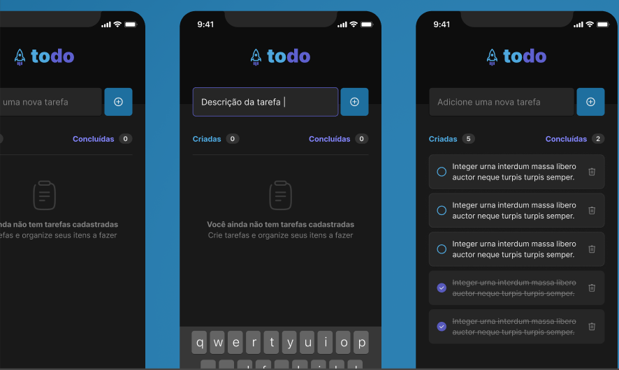

  

 

 Um projeto simples que permite a criação de tarefas. Podemos criar, alterar e deletar.

 

  
  

 

## ⚡ Stack utilizada

- [ReactNative](https://reactnative.dev/)
- [Expo](https://expo.dev/)
- [Typescript](https://www.typescriptlang.org)
